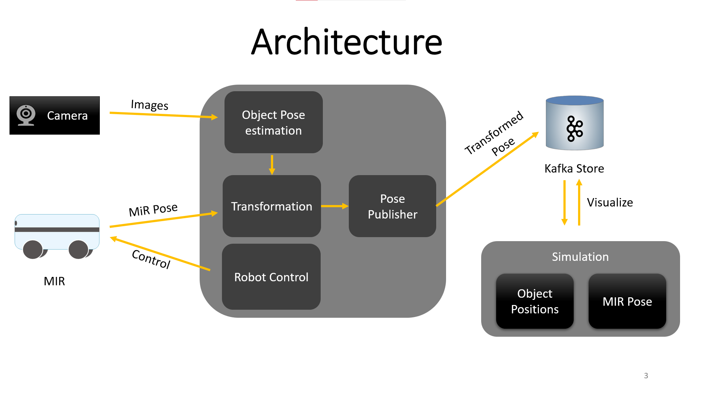
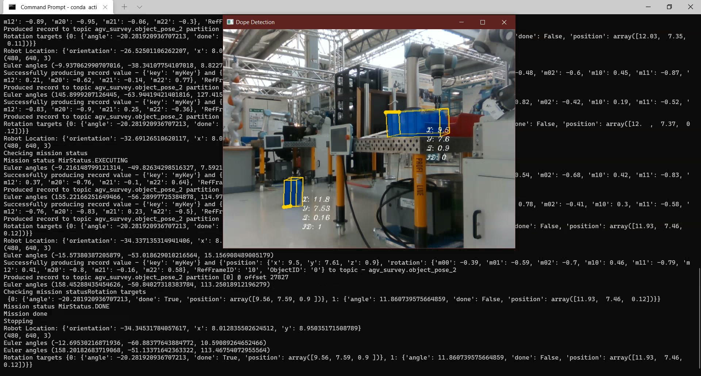

# SupRTwin: Sensing, Unterstanding, and Provisioning of Robotic Digital Twins

This repository contains code for the SupRTwin seminar. In this seminar we worked on AGV (Automated Guided Vehicle) Survey.
We control a MiR100 to navigate automatically and detect a blue box and capture its position and orientation in a world coordinate frame. For 6D pose estimation, we have used [DOPE](https://github.com/NVlabs/Deep_Object_Pose)

**Objectives**
1. High level control of a MiR100
2. 3D Object Detection and Pose estimation
3. Process and persist obtained information in a digital twin (Kafka Cluster)
4. Visualize the obtained data in a simulation

**Architecture**

**Result**

Detected Objects along with their position and orientation.

